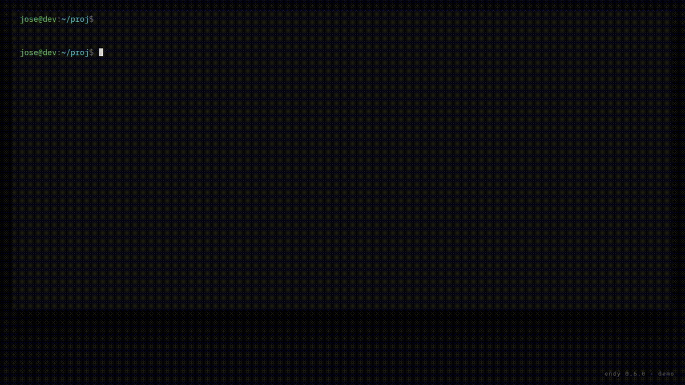

# endy

> A tmux control plane that hands a coding task from one CLI agent to another
> when one runs out of tier.

<!-- DEMO_GIF -->
<p align="center">
  
</p>

<sub align="center">Recording script: <a href="docs/demo.md">docs/demo.md</a>.</sub>

## Why

I kept hitting my paid agent's weekly cap on a Thursday afternoon, with a
task half done in a tmux window I couldn't extend. The other CLIs I had
installed — Gemini, OpenCode, CommandCode, Hermes — were idle, on free
tiers, perfectly capable of continuing the work. They just didn't know
about each other.

endy is the layer that makes them know.

## What it does

One command:

```bash
endy handoff <task-id> --to <next-agent>
```

reads the original prompt, tails the previous agent's output, opens a new
tmux window with a different CLI, and tells it:

> *Here is what was being done. Here is the full output of what your
> predecessor wrote. The previous agent stopped because of `<reason>`.
> Continue.*

The new agent picks up. The chain is recorded in the task's meta file
(`handoff_from=…`, `handoff_chain=…`), so `taskA(opencode) → taskB(cmd) →
taskC(hermes)` is fully traceable. Same `.logs/` directory, same web
dashboard, same `endy watch` family of commands.

If you set `ENDY_HANDOFF_RESOLVER` to a script that prints an agent name
(for example a wrapper around [multiplexor][multiplexor]), the `--to` flag
becomes optional and routing happens automatically when one tier runs dry.

## The stack

| Layer | Agent | Tier | Notes |
|---|---|---|---|
| Orchestrator | `codex` | paid | Long context, good at planning. You pay only for the conductor. |
| Worker | `opencode` | free (multiple backends) | Default for refactors, tests, fast edits |
| Worker | `cmd` (CommandCode / Kimi K2.6) | ~€1 buys a lot of work | Strong taste reviewer; cheapest paid option |
| Worker | `hermes` (Nous Research) | depends on backend (configurable per provider, incl. Copilot) | Tool-heavy agentic work |
| Worker | `gemini` (Google Gemini CLI) | free daily quota | Wide reach |
| Fallback | local model (Ollama, via [multiplexor][multiplexor]) | local | When everything else is exhausted |
| Smoke testing | `bash` (offline stub) | free | Spawns a no-op window so you can rehearse handoff chains without burning real-agent credits |

You only install the ones you want. `endy doctor` shows what is wired up
and authenticated.

## Quickstart

Prereqs (macOS or Linux): `tmux`, `python3`, and at least one of
`codex` / `opencode` / `cmd` / `hermes` / `claude` / `gemini` on `PATH`.

```bash
npm install -g @noetiklab/endy
endy install                     # idempotent: symlinks, completion, PATH,
                                 # AND bootstraps multiplexor from PyPI
                                 # (the routing policy — see below)
exec "$SHELL" -l
endy doctor
```

Or from source:

```bash
git clone https://github.com/trentisiete/endy.git
cd endy && ./scripts/install.sh --yes
exec "$SHELL" -l
```

## The 60-second demo

```bash
cd ~/work/my-project
endy start                                            # tmux session for this dir

endy spawn opencode -- "refactor src/auth/ to use the new IdentityProvider interface, then run npm test"

endy watch tree                                       # see it running
# (opencode hits a rate limit, log shows "RESOURCE_EXHAUSTED")

endy handoff <task-id> --to cmd --reason "rate limited" --stop-parent
# → new cmd window opens, reads the original prompt + the FULL log of what
#   opencode produced, and continues from where opencode stopped. Add
#   --stop-parent to close the rate-limited window in the same shot.
#   (Use --lines N to truncate if you're handing off to a small-context
#   target like gemini free.)
```

Want to rehearse the loop without burning any real-agent credit? Use the
offline `bash` stub:

```bash
endy spawn bash -- "pretend to be doing work"
endy handoff <task-id> --to bash --reason "smoke test"
endy watch tree
```

You get a real handoff chain in `.logs/` and a real new tmux window — the
agent just doesn't call out to a real model. Useful for testing the
dashboard, the tree view, and your demo recording.

That is the loop. Everything else in endy exists to make this one command
not feel magical:

- `endy spawn` writes a strict `.logs/task-<id>.{log,meta,prompt.md}`
  contract so any frontend can read it.
- `endy watch` shows the chain across tmux sessions, web dashboard, and
  your phone over Tailscale.
- `endy chat`, `endy ask`, `endy watch followup` cover same-agent
  continuation, interactive takeover, and one-shot questions.

## Status

Honest table — what is shippable today, what is on the roadmap. Phase
labels match [docs/roadmap.md](docs/roadmap.md).

| Phase | Feature | Status |
|---|---|---|
| 0 | README + docs repositioning + LICENSE + PyPI metadata | shipped |
| 1 | `endy spawn` / `ask` / `chat` / `watch` basic stack | shipped |
| 1 | `endy handoff <id> --to <agent>` (manual handoff) | shipped |
| 1 | Web dashboard + Tailscale mobile | shipped |
| 1 | Per-directory tmux sessions + global `endy overview` | shipped |
| 1 | `endy watch tree` / `list` render the `↪ handoff from X` chain | shipped |
| 1 | Web dashboard cards show `↪ from <short>` + full chain panel | shipped |
| 2 | `endy install` bootstraps multiplexor from PyPI automatically | shipped |
| 2 | `ENDY_HANDOFF_RESOLVER` auto-routing (no `--to` needed) | shipped |
| 2 | `multiplexor next-provider` + `multiplexor status --json` | shipped |
| 3 | `endy state` snapshot + auto-prepended environment block | shipped |
| 3 | `codex/skills/endy-state` Codex skill | shipped |
| 4 | Auto-detection of exhaustion from CLI stderr signals | planned |
| 5 | Git worktree per spawned task (parallel isolation) | planned |
| 6 | npm 0.6.0+ stable surface, real demo GIF, public launch | planned |

Today you decide *when* to call `endy handoff`; multiplexor decides
*who* picks up next. Phase 4 will detect exhaustion from CLI stderr
signals (Gemini's `RESOURCE_EXHAUSTED`, opencode's
`ProviderModelNotFoundError`, cmd's auth/quota errors, hermes's
session-end markers) and dispatch the handoff itself.

## Multiplexor

[multiplexor][multiplexor] is the routing layer. It knows which CLIs you
have installed, scores them by `priority + tier_bonus`, and picks the
best one. When you wire it as `ENDY_HANDOFF_RESOLVER`, every `endy handoff`
without an explicit `--to` calls multiplexor for the next eligible agent.

You do not install it separately: `endy install` already pulls
[`endy-multiplexor`][mxp-pypi] from PyPI (via `pipx` / `uv tool` / `pip
--user`, in that order of preference) and exports
`ENDY_HANDOFF_RESOLVER=multiplexor-next-provider` into your shell
startup. Pass `--no-multiplexor` to `endy install` if you want to skip
it.

The two repos are independent — you can use either alone — but they are
designed to compose. endy is the runtime; multiplexor is the policy.

[mxp-pypi]: https://pypi.org/project/endy-multiplexor/

## A note on terms of service

endy executes each CLI under its own contract. You are responsible for
using each provider within the terms you agreed to — including any limits
on automation, free-tier eligibility, or use as a backing model for other
applications. endy does not bypass quotas, scrape balances, or store
credentials. It moves work between CLIs you have already authenticated
yourself.

## Documentation

- [docs/operations.md](docs/operations.md) — full command reference, manager workflows, the `endy watch` family, the `.logs/` contract, web dashboard internals
- [docs/cli-gotchas.md](docs/cli-gotchas.md) — per-CLI quirks (`opencode --dir`, `cmd --max-turns`, `hermes -Q`, tmux specifics)
- [docs/demo.md](docs/demo.md) — script for recording the handoff GIF, beat-by-beat
- [docs/roadmap.md](docs/roadmap.md) — phases 0-6 with closing commits and what's coming next

`endy help` prints top-level usage. `endy help <agent>` (where `<agent>` is
one of `opencode`, `cmd`, `hermes`, `claude`, `gemini`, `bash`, `tmux`)
prints the relevant section of the gotchas doc.

## Related

- [multiplexor][multiplexor] — routes a task to the highest-scored eligible CLI
- [@noetiklab/endy on npm](https://www.npmjs.com/package/@noetiklab/endy)

## License

[MIT](LICENSE).

[multiplexor]: https://github.com/trentisiete/multiplexor
